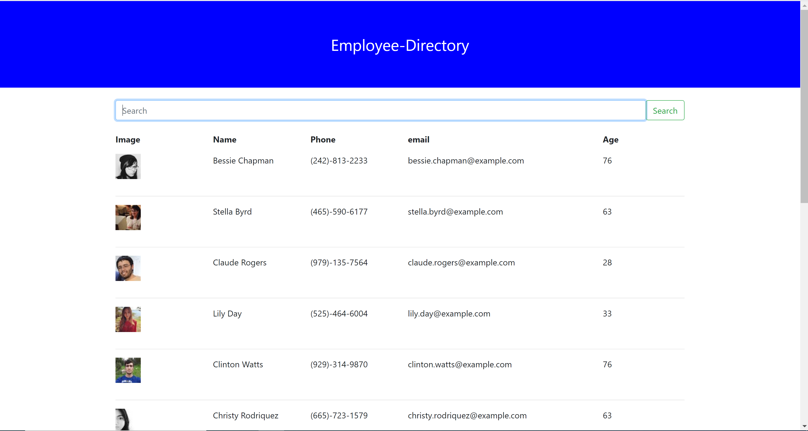

# Employee Directory

## Description:
Application that has random employees a user can search

## Tools:
* React
* Node
* Axios
* Bootstrap
* Javascript
* Random User API

## User Expierence:
The user is presented with the main page that features the search field and button with Employee information below.
Each employee has an Image, First/Last Name, Phone Number, Email, and Age in the corresponding columns. The user can
type a name in the search field and press enter or click the search button and can filter employees.

## Image:

## Links:
https://github.com/JosephRhines/employee-directory

